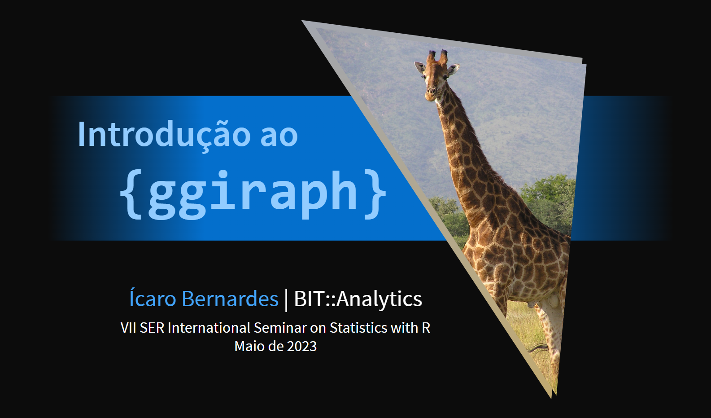

# Curso de introdução a produção de gráficos interativos com `{ggiraph}`

Este curso rápido (20 min) foi pensado para usuários de ggplot de todos os níveis. Nele são abordados:
- os fundamentos do `{ggplot2}`;
- os três passos na construção de um gráfico interativo com `{ggiraph}`;
- o mapeamento interativo no pacote (argumentos da função `aes()`);
- customização do gráfico (família de funções `opts_xxx()`);
- como por tais gráficos em documentos interativos (como um Quarto HTML ou um Shiny app).

O repositório guarda:
- Os [slides](https://icarobernardes.github.io/curso-ggiraph/) do curso, hospedados no Github Pages;
- O [código](https://github.com/IcaroBernardes/curso-ggiraph/blob/master/index.qmd) e [anexos](https://github.com/IcaroBernardes/curso-ggiraph/tree/master/www) usados na produção dos slides.
